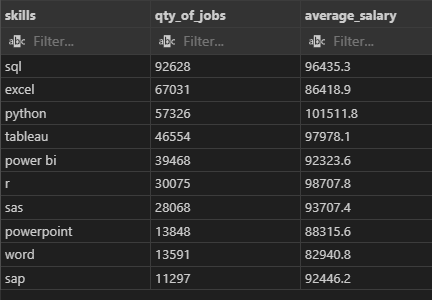

# -Introduction
The following project is focused on understanding the main technical skills looked for in Data Analyst job offers. The data was evaluated in order to understand from a job offering and pay standpoint, which skills are the most attractive to learn.

The SQL code used can be found in my repository location: [project_sql](/project_sql/).


# -Background
Data analysis is an area of huge interest for my profesional carreer. Learning SQL has been great to expand my skills to create more robust and powerful analysis. 

The project was done to showcase the SQL skills learned, using different techniques to obtain the required answers for the outlined questions. 

The analysis was based on the course given by Luke Barousse (https://www.lukebarousse.com/). 

# -Tools Used
The SQL queries used combine using column selection, data aggregations, WHERE statements, CTEs and Subqueries. Multiple ways of obtaining the answers are posible, this coding just shows the way I went through and answered the questions stated. 

The code was written on Microsoft Visual Studio and then used the connectivity with GitHub to upload code versions into the repository.

SQL code used was based from a local database in my PC created with PostgreSQL.


# -Analysis Questions and Breakdown
For the analysis, it was divided in 5 questions that required answering:

**1. What are the top-paying jobs for my role?**
```sql
-- First evaluate the tables we are going to use for the query and get familiar with the column information they provide:

SELECT *
FROM company_dim
LIMIT 10;

SELECT *
FROM job_postings_fact
LIMIT 10;

--Start with the creation a CTE to filter for remote jobs by the TRUE condition for the job_work_from_home column.

WITH remote_jobs AS (
SELECT job_id
FROM job_postings_fact
WHERE job_work_from_home = TRUE
)

-- Create the query to obtain the jobs that are found in the remote jobs CTE: 


SELECT remjob.job_id AS Job_ID, compdim.name AS Company_Name, job_title AS Job_Title, job_work_from_home,salary_year_avg AS Yearly_Salary
FROM job_postings_fact AS jbf

--Include the company name using a left join to the company_dim table. 
LEFT JOIN company_dim AS compdim ON jbf.company_id = compdim.company_id

-- Innter join to obtain only remote jobs from the CTE.
INNER JOIN remote_jobs AS remjob ON jbf.job_id = remjob.job_id

-- We filter a couple of things: Data Analyst Jobs as well as eliminate NULL values in the yearly salary column to clean the data. 
WHERE job_title_short = 'Data Analyst' AND
      salary_year_avg IS NOT NULL

-- Order by Salary and obtain the top 10 highest-paying jobs.
ORDER BY salary_year_avg DESC
LIMIT 10;
```

**2. What are the skills required for these top-paying roles?**

```sql
-- To answer the question: use and start building from the query created in top paying jobs file:
WITH remote_jobs AS (
SELECT job_id
FROM job_postings_fact
WHERE job_work_from_home = TRUE
)


SELECT  top_10_jobs.Company_Name, skills_dim.skills AS Skill_Name, top_10_jobs.yearly_salary

-- Use the previous query as a subquery in order to build from the table of the top 10 paying jobs:
FROM (

SELECT remjob.job_id AS Job_ID, compdim.name AS Company_Name, job_title AS Job_Title, job_work_from_home,salary_year_avg AS Yearly_Salary
FROM job_postings_fact AS jbf

LEFT JOIN company_dim AS compdim ON jbf.company_id = compdim.company_id
INNER JOIN remote_jobs AS remjob ON jbf.job_id = remjob.job_id

WHERE job_title_short = 'Data Analyst' AND
      salary_year_avg IS NOT NULL

ORDER BY salary_year_avg DESC
LIMIT 10
) AS top_10_jobs

-- with the subquery defined, we obtain the skill id from the skill job table and the skill name from the skill tabe:

LEFT JOIN skills_job_dim AS skilljob ON skilljob.job_id = top_10_jobs.job_id

LEFT JOIN skills_dim ON skills_dim.skill_id = skilljob.skill_id

-- last, filter out the job ids that are null as they provide no information we need.
WHERE skilljob.job_id IS NOT NULL
ORDER BY Yearly_Salary DESC;

```

**3. What are the most in-demand skills for my role?**

```sql

--Select the skill name from the skill dim table and count the number of job ids from the job postings according to the Data Anlayst filter:
SELECT skills_dim.skills, COUNT(jbf.job_id) AS Qty_of_Jobs

FROM job_postings_fact AS jbf

-- Use Inner Joins to obtain the connection of skill job dim and skill dim tables to obtain the job name. 
INNER JOIN skills_job_dim ON jbf.job_id = skills_job_dim.job_id
INNER JOIN skills_dim ON skills_job_dim.skill_id = skills_dim.skill_id

--Use WHERE to filter only DATA ANALYST jobs. 
WHERE jbf.job_title_short = 'Data Analyst' 


-- Group by the skill name to make the aggregation of data and order them by the qty of jobs posted. 
GROUP BY skills_dim.skills
ORDER BY Qty_of_Jobs DESC
LIMIT 5;
```


**4. What are the top skills based on salary for my role?**

```sql
-- Based on the previous query for the top demand skills, modify the code in order to obtain the Round Average year salary:

SELECT skills_dim.skills, ROUND(AVG(salary_year_avg),1) AS Average_Salary

FROM job_postings_fact AS jbf


INNER JOIN skills_job_dim ON jbf.job_id = skills_job_dim.job_id
INNER JOIN skills_dim ON skills_job_dim.skill_id = skills_dim.skill_id


-- Add the IS NOT NULL for the salary_year_avg column to clean the data:
WHERE jbf.job_title_short = 'Data Analyst' AND salary_year_avg IS NOT NULL


GROUP BY skills_dim.skills

-- Order by the top 10 averages.
ORDER BY Average_Salary DESC
LIMIT 10;

```

**5. What are the most optimal skills to learn?**

```sql

-- Using both previous queries done to have the top demand and top paying skills, we build two CTEs:

WITH top_demand_skills AS(
    SELECT skills_dim.skills, COUNT(jbf.job_id) AS Qty_of_Jobs

    FROM job_postings_fact AS jbf
    INNER JOIN skills_job_dim ON jbf.job_id = skills_job_dim.job_id
    INNER JOIN skills_dim ON skills_job_dim.skill_id = skills_dim.skill_id
    WHERE jbf.job_title_short = 'Data Analyst'
    GROUP BY skills_dim.skills

), highest_paying_skills AS(

    SELECT skills_dim.skills, ROUND(AVG(salary_year_avg),1) AS Average_Salary
    FROM job_postings_fact AS jbf
    INNER JOIN skills_job_dim ON jbf.job_id = skills_job_dim.job_id
    INNER JOIN skills_dim ON skills_job_dim.skill_id = skills_dim.skill_id
    WHERE jbf.job_title_short = 'Data Analyst' AND salary_year_avg IS NOT NULL 
    GROUP BY skills_dim.skills

)

-- Use inner join to obtain only the skills present in both CTEs, including the quantity of jobs and the average salary data:

SELECT top_demand_skills.skills, top_demand_skills.Qty_of_Jobs, highest_paying_skills.Average_Salary
FROM top_demand_skills
INNER JOIN highest_paying_skills ON top_demand_skills.skills = highest_paying_skills.skills

-- Setup the order by first the highest demand skills and then the highest paying skills:
ORDER BY top_demand_skills.Qty_of_Jobs DESC, highest_paying_skills.Average_Salary DESC

-- TOP 10
LIMIT 10;

```


# -Conclusion

According to the code used, the following answers where found:

1. What are the top-paying jobs for my role?

The first query showed the top paying jobs for Data Analyst positions:


2. What are the skills required for these top-paying roles? 

From the top paying jobs obtained, the skills required for the positions where selected:
Note: image does not show the full length of results.


3. What are the most in-demand skills for my role?

According to Data Analyst job position postings, the following where the highest demand skills, set at the top 5:


4. What are the top skills based on salary for my role? 

Based purely on yearly salary, the following skills where obtained, potentially related to niche technical skills for data analysts:


5. What are the most optimal skills to learn?

Finally, joining the top demand and highest paying skills, the following was obtained, prioritized on skill demand and then paying. The following table shows the top 10 skills based on those criteria:

